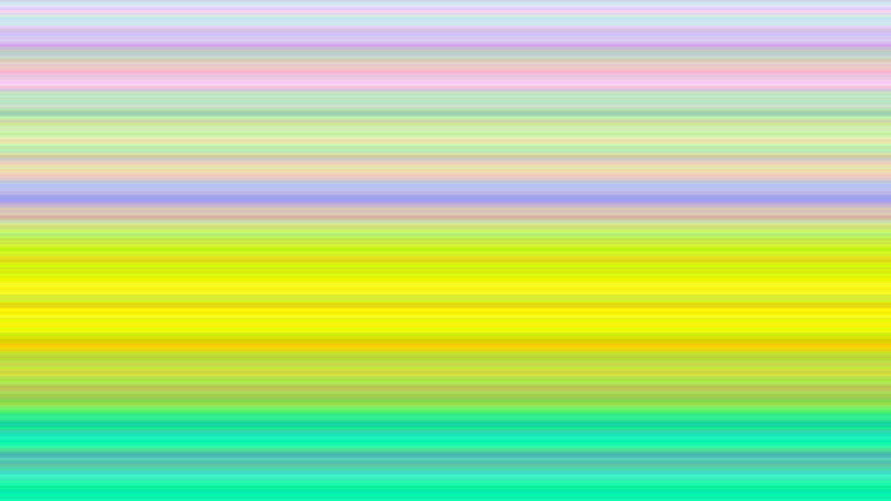
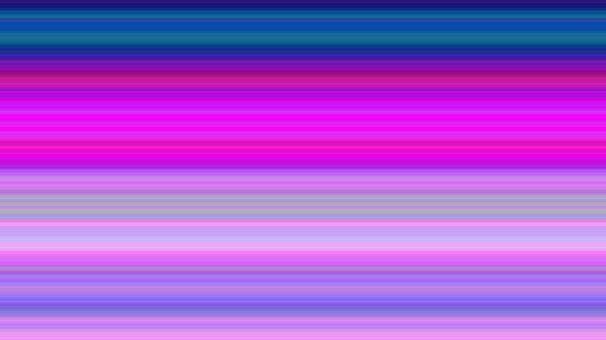

# Gerhard

Inspired by [Gerhard Richter's Strip](https://www.gerhard-richter.com/en/art/paintings/abstracts/strips-93) artwork I created a generator that makes the same kind of digital art.

## Install 

Clone or fork the repository:

```sh-session
$ git clone https://github.com/cleanunicorn/gerhard
```

Install required libraries:

```sh-session
$ cd gerhard
$ pip install -r requirements.txt --user
```

Checkout the help:
```sh-session
$ python ./main.py --color proxy -h                            
usage: main.py [-h] [--width WIDTH] [--height HEIGHT] [--color {random,proxy}]
               [--color-distance COLOR_DISTANCE]
               [--color-random-seed COLOR_RANDOM_SEED] [--output OUTPUT]

A generator in the style of Gerhard Richter's Strip.

optional arguments:
  -h, --help            show this help message and exit
  --width WIDTH         Width of generated image
  --height HEIGHT       Height of the generated image
  --color {random,proxy}
                        Color generator
  --color-distance COLOR_DISTANCE
                        Color distance (0 - 255) if --color is `proxy`
  --color-random-seed COLOR_RANDOM_SEED
                        Random seed for color generator
  --output OUTPUT       File name to generate
```

## Run

### Default mode

Simple output generates a 1920 x 1080 PNG image saved as `output.png` that imitates the original art.

```sh-session
$ python ./main.py
```


### Proxy mode

Starts from a random color and the next line is a close color.

```sh-session
$ python ./main.py --color proxy --color-distance 10
```



### Control randomness

If you find a pattern you really like you can regenerate it. 

A seed for the randomness can be specified to always get the same pattern:

```sh-session
$ python ./main.py --color proxy --color-random-seed 42
```

