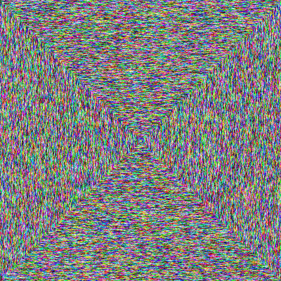

# Gerhard

Inspired by [Gerhard Richter's Strip](https://www.gerhard-richter.com/en/art/paintings/abstracts/strips-93) artwork I created a generator that makes the same kind of digital art.

## Install

Clone or fork the repository:

```sh-session
$ git clone https://github.com/cleanunicorn/gerhard
```

Install required libraries and the package:

```sh-session
$ cd gerhard
$ pip install -r requirements.txt --user
$ pip install --editable --user .
```

This will make `gerhard` available in your terminal:
```sh-session
$ gerhard --help
Usage: gerhard [OPTIONS]

  An image generator in the style of Gerhard Richter's Strip

Options:
  --width INTEGER           width of generated image
  --height INTEGER          height of generated image
  --color [random|proxy]    color generator  [default: random; required]
  --color-distance INTEGER  color distance in case of [--color proxy], should
                            be between 0 - 255
  --random-seed INTEGER     random seed to generate the same image
  --output TEXT             file name to generate
  --method [lines|spiral]   type of image to generate  [required]
  --help                    Show this message and exit.
```

## Run

### Gerhard method

Simple output generates a 1920 x 1080 PNG image saved as `output-[unix timestamp].png` that imitates the original art.

```sh-session
$ gerhard
```


### Gerhard method, proxy color

Starts from a random color and the next line is a close color.

```sh-session
$ gerhard --color proxy --color-distance 10
```


### Spiral method

Starts for a random color in the middle of the image and draws a spiral with a proxy color.

```sh-session
$ gerhard --width=400 --height=400 --color-distance=100 --method=spiral --color=proxy
```



### Control randomness

If you find a pattern you really like you can regenerate it.

A seed for the randomness can be specified to always get the same pattern:

```sh-session
$ gerhard --color proxy --random-seed 42
```

